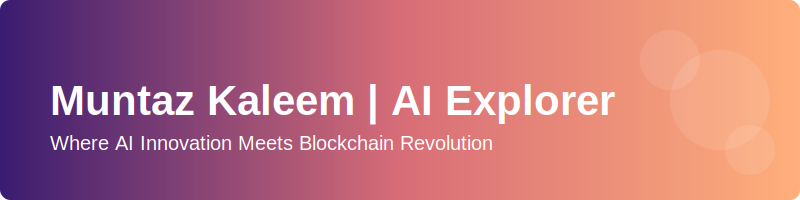

- 🤖 Implementing advanced Retrieval-Augmented Generation (RAG) systems
- 🧩 Designing and developing autonomous AI agents with specialized capabilities
- 📊 Creating data-driven solutions for complex government and enterprise challenges
- 🌐 Building integrated AI systems that leverage LLMs for practical applications

- 💼 **AI Engineer at Augier.ai** - Leading RAG implementation for enterprise solutions
- 🏛️ **Government Contracts via Augierai.com** - Developing specialized AI solutions for government agencies
- 🔗 **AI Agent Development** - Creating autonomous agents that solve complex problems
- 📈 **LLM Systems Architect** - Designing scalable architectures for large language model applications

### 🔭 About Me
I am an AI Engineer specializing in Retrieval-Augmented Generation (RAG) implementations and autonomous AI agent development. At Augier.ai, I focus on building cutting-edge AI solutions that solve real-world problems for both enterprise clients and government contracts through Augierai.com.

With a strong technical background in machine learning and natural language processing, I design and implement systems that combine the power of large language models with custom retrieval mechanisms to create more accurate, reliable, and context-aware AI applications.

### 🔬 Professional Expertise
- 🧠 **RAG Implementation**: Building systems that enhance LLMs with external knowledge retrieval
- 🤖 **AI Agent Development**: Creating autonomous agents with specialized capabilities
- 🔄 **LLM Fine-tuning**: Customizing foundation models for specific domain applications
- 🏛️ **Government AI Solutions**: Developing secure and compliant AI systems for government use
- 📊 **Enterprise AI Integration**: Implementing AI solutions that integrate with existing business systems

**AI & NLP Tools**
- Python | LangChain | LlamaIndex | HuggingFace Transformers
- OpenAI API | Anthropic Claude | Embeddings | Vector Databases

**Infrastructure & Deployment**
- Docker | Kubernetes | AWS | Azure | GCP
- FastAPI | Flask | MLflow | Weights & Biases | Git

### 📚 Current Projects at Augier.ai
- **Enterprise RAG System**: Building scalable retrieval systems for corporate knowledge bases
- **Autonomous Agent Framework**: Developing a framework for creating specialized AI agents
- **Government Data Processing**: Creating secure AI solutions for government document analysis
- **Multi-Modal LLM Integration**: Implementing systems that combine text, image, and audio analysis

### 🔮 Research Focus
- Improving RAG relevancy and reducing hallucinations in LLM outputs
- Developing more efficient context management for long-context applications
- Creating reliable evaluation methods for RAG system performance
- Advancing multi-agent systems for complex problem-solving

### 📫 Connect With Me
I'm always interested in discussing RAG implementations, AI agent development, and enterprise AI solutions. If you're working on challenging AI projects or looking for expertise in these areas, let's connect!

### 🌱 Current Professional Focus
- 📚 Advancing the state of RAG technology for enterprise applications
- 🔧 Building more capable and reliable autonomous AI agents
- 🤝 Collaborating with government agencies to implement secure AI solutions
- 🎓 Researching the latest advancements in LLM technology and retrieval systems

### 💡 Fun Fact
When I'm not engineering AI systems, I'm exploring ways to make large language models more factual, reliable, and beneficial for society. I believe that RAG is a critical component in building trustworthy AI that can augment human capabilities while maintaining accuracy and transparency.
