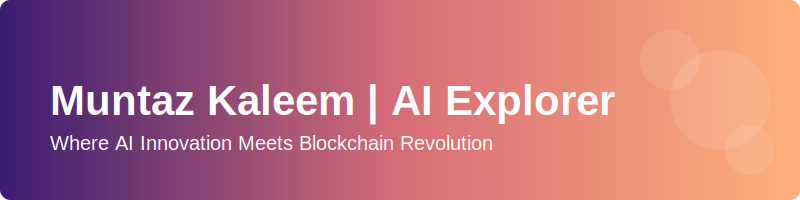

**AI Engineer — autonomous agents, RAG, and the orchestration that makes them production-grade.**

Enterprise & government AI at [Augier.ai](https://augierai.com)


</div>

---

### About

I build autonomous AI agents on solid machine-learning fundamentals — and the orchestration layer that makes them dependable in production. Most "AI agents" are a prompt and a hope; I build agents that **measure, decide, and improve**, with real decision math underneath and verification at every gate.

At Augier.ai I lead RAG and multi-agent systems for enterprise clients and government contracts — secure, compliant, and built to run.

---

### What I Build

| Area | Focus |
|---|---|
| **Autonomous agents** | Tool-using agents that reason per task and choose which capability to invoke — not rigid pipelines |
| **ML-grounded decisioning** | Action selection via multi-armed bandits (UCB1), Thompson sampling, and Bayesian A/B evaluation |
| **Retrieval-Augmented Generation** | Hybrid semantic + keyword retrieval, context engineering, and anti-hallucination evaluation |
| **Multi-agent orchestration** | Parallel agents in isolated workspaces, governed by explicit contracts, integrated through review gates |
| **Production AI** | Human-in-the-loop gating, idempotency, circuit breakers, cost tracking, auditable action logs |

---

### How I Build

- **Agents reason, not pipeline** — each receives a goal and context, then decides which tools to call.
- **Every decision is measured** — actions logged with confidence and outcome; a learning loop re-weights strategies so the system improves itself.
- **Orchestration over headcount** — many agents run in parallel, isolated and contract-governed, integrated via review.
- **Verification before claims** — nothing ships without tests run and output confirmed. Evidence, not assertion.
- **Human-in-the-loop where it matters** — high-stakes outputs are gated for review, never sent autonomously.

---

### Core Stack

```
AI / ML        Python · Anthropic Claude · OpenAI · Claude Agent SDK · MCP
RAG            LangChain · LlamaIndex · HuggingFace · embeddings · vector DBs · Neo4j
Decisioning    multi-armed bandits · Thompson sampling · Bayesian A/B · eval harnesses
Infra          Docker · Kubernetes · AWS · Azure · GCP · FastAPI · MLflow · W&B
```

---

### Focus

Reducing hallucination in production RAG · decision-theoretic agent control · reproducible evaluation for agent systems · multi-agent coordination for long-horizon problems.

---

<div align="center">

**Building hard AI? Let's connect.**


</div>
